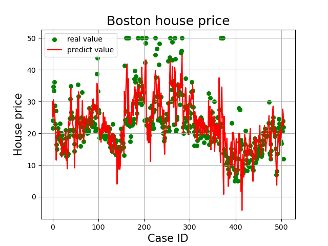
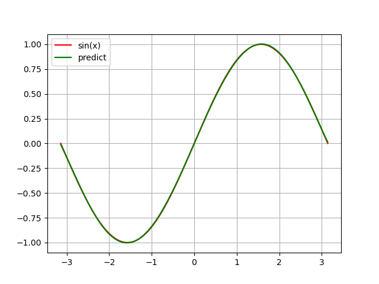
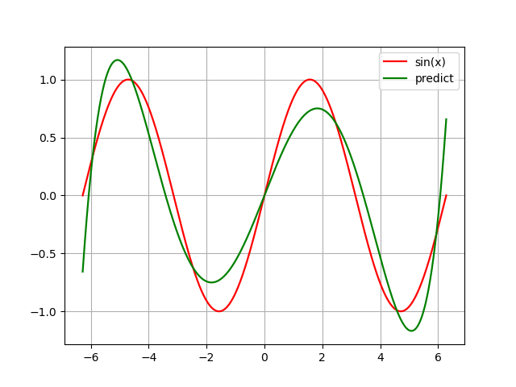
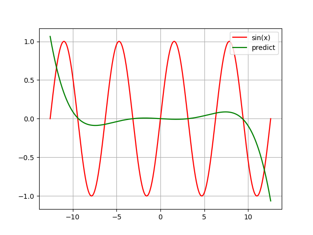

# ML
机器学习课程的作业仓库。

## 作业一：梯度下降法

### 文件列表

- **linearregression.py**  
  构建线性回归类，实现梯度下降算法。

- **bostonhouseprice.py**  
  处理波士顿房价数据集并进行线性回归预测。

- **sinxfuction.py**  
  - **生成从 -pi 到 pi 的 sin(x) 数据样本集并进行线性回归预测。**

  - **若是生成的sin(x)是多个周期的样本，我所实现的梯度下降算法貌似做不到正常的拟合。**

